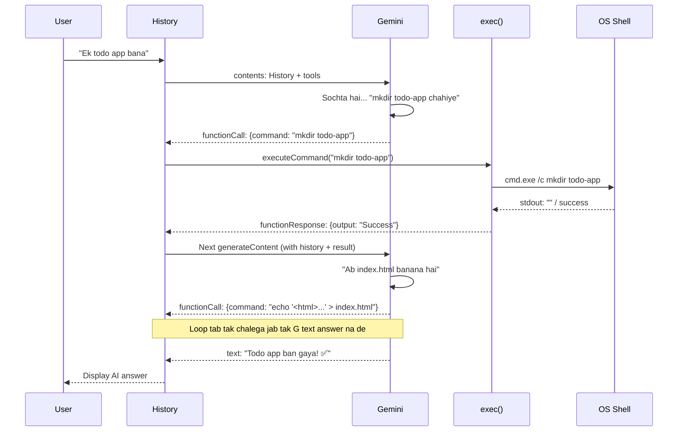

# 🚀 Create OWN Cursor - Apna AI Website Builder Agent

> **Tagline:** Cursor jaisa AI Agent khud banao, samjho kaise kaam karta hai andar se!


---

### 📚 Table of Contents
1. [Intro - Ye Project Kya Hai?](#-1-intro--ye-project-kya-hai)
2. [Kaise Kaam Karta Hai? - High Level Flow](#-2-kaise-kaam-karta-hai--high-level-flow)
3. [Code Walkthrough - Line by Line Deep Dive](#-3-code-walkthrough--line-by-line-deep-dive)
4. [Child Process - Deep Knowledge](#-4-child-process--deep-knowledge)
5. [Diagram Explanations](#-5-diagram-explanations)
6. [Gemini Tool / Function Calling Kya Hai?](#-6-gemini-tool--function-calling-kya-hai)
7. [Sabse Bada Bug - `thought_signature` Wala Kaand](#-7-sabse-bada-bug---thought_signature-wala-kaand)
8. [Real Life Usages - Isse Kya-Kya Ban Sakta Hai?](#-8-real-life-usages--isse-kya-kya-ban-sakta-hai)
9. [Setup & Run - Kaise Chalana Hai](#-9-setup--run---kaise-chalana-hai)
10. [Common Bugs & Fixes](#-10-common-bugs--fixes)
11. [Aage Kya Seekhu? - Next Steps](#-11-aage-kya-seekhu---next-steps)

---

## 📌 1. Intro — Ye Project Kya Hai?

Dekho bhai, simple shabdon me:

> Ye ek **AI Agent** hai jo tumhari baat sunke **khud website bana deta hai** — folder banayega, file likhega, code likhega, aur error aaye toh fix bhi karega. Bilkul **Cursor / Copilot** ki tarah!

### Real me kya hota hai?
Tum bolte ho:
```
"Ek portfolio website bana de, dark theme me"
```
Aur ye agent:
1. `mkdir portfolio` chalata hai
2. `index.html` banata hai
3. Usme HTML/CSS/JS likhta hai
4. Live karke dikha deta hai

**Yehi hai Agentic AI ka magic!** LLM sirf text nahi de raha, **terminal command run karke actual kaam kar raha hai.**

### Tech Stack Kya Use Hua?

| Cheez | Kyu Use Ki? |
|-------|-------------|
| `Node.js` | Backend runtime |
| `@google/genai` (Gemini 2.5 Flash) | Dimaag — sochne aur command decide karne ke liye |
| `child_process` | Haath — terminal command chalane ke liye |
| `readline-sync` | Kaan aur Muh — user se baat karne ke liye |
| `dotenv` | Tijori — API Key chhupake rakhne ke liye |
| `os` | Pehchan — Windows hai ya Mac/Linux? |

---

## 🔄 2. Kaise Kaam Karta Hai? — High Level Flow

Socho ye ek **loop** hai. Jab tak AI ko kaam karna hai, tab tak ghoomta rahega.

```
User: "Todo app bana de"
  ↓
History me save → Gemini ko bhejo
  ↓
Gemini sochta hai → "mkdir todo-app" (Tool Call)
  ↓
Node.js exec() se command chalao → result wapas
  ↓
Result Gemini ko bhejo → Gemini next command sochta hai
  ↓
... loop chalta rahega ...
  ↓
Jab kaam khatam → Gemini bolta hai "Ho gaya bhai, check kar lo!"
  ↓
Loop break, user se next input lo
```

**Ek line me:** `User → History → Gemini → Tool Call → exec() → Result → Gemini → ... → Final Answer`

---

## 💻 3. Code Walkthrough — Line by Line Deep Dive

### 3.1 Imports & Setup

```js
import { GoogleGenAI, Type } from "@google/genai/node";
import { exec } from "child_process";
import util from "util";
import os from "os";
import 'dotenv/config';
import readlineSync from "readline-sync";

const platform = os.platform(); // "win32", "linux", "darwin"
const execute = util.promisify(exec); // callback → promise me convert!

if (!process.env.GEMINI_API_KEY) {
    console.error("❌ Missing GEMINI_API_KEY in .env");
    process.exit(1);
}
const ai = new GoogleGenAI({ apiKey: process.env.GEMINI_API_KEY });
```

**Deep Knowledge:**

*   **`@google/genai/node` kyu?** Normal `@google/genai` se import karoge toh error aayega: `An API Key must be set...` Kyuki wo web aur node dono ke liye generic hai. Node pe explicit `@google/genai/node` karna padta hai. Ye conditional exports ka chakkar hai.
*   **`util.promisify(exec)` kya hai?** `exec` by default callback style hai: `exec("ls", (err, stdout) => {})`. `promisify` usko `async/await` wala bana deta hai. Matlab `await execute("ls")` kar sakte ho. Clean code!
*   **`os.platform()` kyu?** Kyuki Windows pe `mkdir` alag, Linux/Mac pe alag behave kar sakta hai. AI ko batana padta hai `win32` hai taaki wo `dir` vs `ls` sahi de.

### 3.2 Tool Definition — AI ka Hathiyar

```js
async function executeCommand({ command }) {
    try {
        const { stdout, stderr } = await execute(command);
        if (stderr) return `Error: ${stderr}`;
        return `Command Executed Successfully: ${stdout}`;
    } catch (error) {
        return `Error: ${error.message}`;
    }
}

const commandExecuter = {
    name: "executeCommand",
    description: "Execute a command on the terminal to handle file operations.",
    parameters: {
        type: Type.OBJECT,
        properties: {
            command: {
                type: Type.STRING,
                description: "Terminal/shell command. Ex: mkdir calc, touch index.js"
            }
        },
        required: ["command"]
    }
};
```

**Samjho aise:** Ye `commandExecuter` ek **declaration** hai. Hum Gemini ko bol rahe hai — "Dekh, tere paas ek tool hai `executeCommand`, isme ek string dal — jo bhi terminal command chalana hai." Gemini khud decide karta hai kab aur kya command dena hai. Yehi **Function Calling** hai!

> `Type.OBJECT`, `Type.STRING` — ye Gemini ko schema batate hai taaki wo galat JSON na bheje.

### 3.3 The Heart — `runAgent()` Loop

Ye sabse important function hai. Yahi pe saara jadoo hota hai.

```js
const History = []; // Poori conversation ka memory

async function runAgent() {
    while (true) {
        const response = await ai.models.generateContent({
            model: "gemini-2.5-flash",
            contents: History,
            config: {
                systemInstruction: `You are a website builder... OS is ${platform}`,
                tools: [{ functionDeclarations: [commandExecuter] }]
            },
        });

        const functionCalls = response.functionCalls;
        const candidate = response.candidates?.[0];

        if (functionCalls && functionCalls.length > 0) {
            // ⚠️ IMPORTANT: Poora candidate.content save karo, warna thought_signature error!
            if (candidate?.content) {
                History.push(candidate.content); 
            }

            for (const fc of functionCalls) {
                console.log(`🤖 Tool Call: Executing "${fc.args.command}"...`);
                const toolResult = await executeCommand(fc.args);
                History.push({
                    role: "user",
                    parts: [{
                        functionResponse: {
                            name: fc.name,
                            response: { output: toolResult }
                        }
                    }]
                });
            }
        } else {
            const text = response.text ?? candidate?.content?.parts?.[0]?.text;
            console.log(`🤖 AI: ${text}`);
            History.push({ role: "model", parts: [{ text }] });
            break; // Kaam khatam, loop tod do
        }
    }
}
```

**Deep Dive Points:**

1.  **`History` kyu chahiye?** LLM stateless hai — har baar use pura past bhejna padta hai. Jaise ChatGPT me purane messages bhool jaye toh ajeeb jawab dega, waise hi yaha bhi.
2.  **`while(true)` loop kyu?** Kyuki AI ek baar me ek hi command deta hai. `mkdir` ke baad `touch`, phir `echo code > file`, phir `npm run dev`. Har step ke liye loop ka ek chakkar.
3.  **`break` kab?** Jab `functionCalls` empty aaye — matlab AI ne bola "Ab tool nahi, seedha jawab dena hai" — jaise "Website ban gayi, check karo!"
4.  **`response.text` getter hai!** `@google/genai` v2 me ye property hai, function nahi. Aur backup ke liye `candidates[0].content.parts[0].text` bhi rakha hai.

### 3.4 User Loop — `startApp()`

```js
async function startApp() {
    console.log("Website Builder Agent Ready.");
    while (true) {
        const question = readlineSync.question("\nAsk me anything (or type 'exit'): ");
        if (question.toLowerCase() === "exit") break;

        History.push({ role: "user", parts: [{ text: question }] });
        await runAgent(); // Har question pe agent ko bulao
    }
}
startApp();
```

Ye **outer loop** hai. User se input leta hai, `History` me dalta hai, aur `runAgent` ko trigger karta hai. `exit` likhte hi band.

---

## 🔧 4. Child Process — Deep Knowledge

### 4.1 Child Process Hota Kya Hai?

Node.js single-threaded hai, par `child_process` se tum **alag se terminal / shell process** chala sakte ho. Jaise tum manually CMD me `mkdir` likhte ho, waise hi code se chala sakte ho.

> Simple me: **Node.js = Maalik, Child Process = Naukar** — Maalik bolega "folder bana", Naukar jaake terminal me command chalayega.

### 4.2 4 Tarike — Konsa Kab Use Kare?

| Method | Kaam | Example | Kab Use Kare? |
|--------|------|---------|---------------|
| `exec()` | Shell me command chalao, pura output buffer karo | `exec("ls -la")` | Chhota output, simple command (Hamara case ✅) |
| `execFile()` | Direct file execute, shell nahi | `execFile("node", ["app.js"])` | Security zyada chahiye, shell injection se bachna hai |
| `spawn()` | Bada output, streaming | `spawn("npm", ["install"])` | Jab output bahut bada hai (npm install logs) |
| `fork()` | Naya Node.js process | `fork("worker.js")` | Jab heavy JS kaam alag thread me karna ho |

Hamare project me `exec` best hai kyuki command chhote hai (`mkdir`, `echo`, `dir`) aur pura output ek saath chahiye.

### 4.3 Code Snippet Deep Dive

```js
import { exec } from "child_process";
import util from "util";
const execute = util.promisify(exec);

// ❌ Callback Hell (Purana tarika)
exec("mkdir test", (error, stdout, stderr) => {
    if (error) console.log(error);
    console.log(stdout);
});

// ✅ Promise wala (Hamara tarika - clean!)
try {
    const { stdout, stderr } = await execute("mkdir test");
    console.log(stdout);
} catch (e) {
    console.log("Fail ho gaya:", e.message);
}

// ⚠️ Security Note - Kabhi bhi user input direct exec me mat dalo bina sanitize kiye!
// User ne bola: "test; rm -rf /"  -> Khatarnak ho sakta hai!
// Isliye production me `execFile` ya input validation use karo.
```

### 4.4 Diagram — Child Process Under the Hood

```
┌─────────────────┐
│   Node.js       │  Main Thread (Event Loop)
│   index.js      │
└────────┬────────┘
         │  execute("mkdir portfolio")
         ▼
┌─────────────────┐
│  Child Process  │  Alag OS Process (cmd.exe / bash)
│  Shell          │  Command run karta hai
└────────┬────────┘
         │  stdout / stderr
         ▼
┌─────────────────┐
│   Node.js       │  Result wapas, History me save
└─────────────────┘
```

---

## 📊 5. Diagram Explanations

### 5.1 Architecture Diagram — Pure System Ka Naksha

```mermaid
graph TD
    A[👤 User Input\nreadline-sync] --> B[📜 History Array\nMemory]
    B --> C[🤖 Gemini 2.5 Flash\nLLM + Tools]
    C -->|Tool Call: executeCommand| D[⚙️ executeCommand()\nchild_process.exec]
    C -->|No Tool Call| E[💬 Final Answer\nDisplay to User]
    D --> F[💻 OS Shell\nwin32 / linux]
    F --> G[📁 File System\nmkdir, touch, echo]
    G -->|stdout/stderr| D
    D -->|functionResponse| B
    B --> C
    E --> A
```

**Samjho:** User → History → Gemini → (agar tool hai toh) Shell → File System → wapas History → Gemini... jab tak final answer na aa jaye.

### 5.2 Sequence Diagram — Ek Command Ka Safar



### 5.3 History Kaise Banta Hai? — Visual

```
Turn 1: User
  History = [ {role: "user", parts: [{text: "todo app bana"}]} ]

Turn 2: Model (Tool Call)
  History = [ ..., {role: "model", parts: [{functionCall: {name: "executeCommand", args: {command: "mkdir todo-app"}}}]} ]

Turn 3: User (Tool Result) - IMPORTANT: role "user" hi hota hai!
  History = [ ..., {role: "user", parts: [{functionResponse: {name: "executeCommand", response: {output: "Success"}}}]} ]

Turn 4: Model (Final Text)
  History = [ ..., {role: "model", parts: [{text: "Ho gaya bhai!"}]} ]
```

> ⚠️ Dhyaan do: `functionResponse` ka `role` **hamesha `user`** hota hai, `tool` nahi! Ye Gemini ka rule hai. Galat role doge toh 400 error.

---

## 🧠 6. Gemini Tool / Function Calling Kya Hai?

Normal LLM sirf text deta hai. **Function Calling** se LLM **JSON** deta hai jo code execute kar sakta hai.

### Example:

**Tumne bola:** "Mumbai ka weather bata"

**Without Tool:**
> "Mujhe nahi pata, internet nahi hai" 😢

**With Tool (Function Calling):**
```json
// Gemini ka response
{
  "functionCall": {
    "name": "getWeather",
    "args": { "city": "Mumbai" }
  }
}
```
Fir tumhara code `getWeather({city: "Mumbai"})` chalake result wapas Gemini ko bhejta hai, aur Gemini bolta hai "Mumbai me 32°C hai" 😎

### Hamare Project me:

```js
// Humne declare kiya
tools: [{ functionDeclarations: [commandExecuter] }]
// Matlab Gemini ko bola: "Tere paas bas ek hi tool hai - executeCommand"

// Gemini decide karta hai:
// User: "website bana" -> Gemini: {command: "mkdir website"}
// User: "hi" -> Gemini: "Hello! Kaise madad karu?" (No tool call)
```

---

## 💣 7. Sabse Bada Bug — `thought_signature` Wala Kaand

### Error Kya Tha?
```
ApiError: 400 INVALID_ARGUMENT
Function call is missing a thought_signature in functionCall parts.
This is required for tools to work correctly...
```

### Kyu Aaya?

`gemini-2.5-flash` ek **Thinking Model** hai — matlab wo jawab dene se pehle andar hi andar sochta hai (thought). Har `functionCall` ke saath ek hidden `thoughtSignature` aata hai — jaise signature / stamp.

**Galat tarika (Pehle wala code):**
```js
// Hum manually bana rahe the — signature gayab!
History.push({
    role: "model",
    parts: [{ functionCall: { name, args } }] // ❌ thoughtSignature missing!
});
```
Next API call pe Gemini bolta hai: "Arey stamp kaha hai? Bina stamp ke entry nahi!"

**Sahi tarika (Fixed code):**
```js
const candidate = response.candidates?.[0];
if (candidate?.content) {
    History.push(candidate.content); // ✅ Poora content, signature ke saath!
}
```
**Rule:** `candidate.content` ko **jaise ka waisa** History me push karo. Khud se reconstruct mat karo.

> Docs: https://ai.google.dev/gemini-api/docs/thought-signatures

### Dusre Bugs Jo Fix Kiye:

| Bug | Pehle | Fix |
|-----|-------|-----|
| **Import** | `from "@google/genai"` + `new GoogleGenAI({})` → crash | `from "@google/genai/node"` + `apiKey: process.env.GEMINI_API_KEY` |
| **Model Name** | `gemini-3.6-flash` (exist hi nahi karta) | `gemini-2.5-flash` |
| **Plural Typo** | `functionCalls` (galat key) | `functionCall` (singular) |

---

## 🌍 8. Real Life Usages — Isse Kya-Kya Ban Sakta Hai?

Ye chhota sa project actually **bahut bade concepts** ka base hai:

### 8.1 Real Products Jo Aise Hi Kaam Karte Hai:
*   **Cursor / Windsurf / Copilot Workspace** — Tum prompt do, AI pura codebase change kar de.
*   **Devin AI** — World's first AI Software Engineer — ye bhi `exec` se hi code chalata hai!
*   **Vercel v0** — "Ek dashboard bana" bolo, React code generate + preview.
*   **Lovable / Bolt.new** — Prompt se full-stack website.

### 8.2 Tum Is Idea Se Kya Bana Sakte Ho?

| Idea | Kaise? |
|------|--------|
| **Auto Bug Fixer** | `npm test` chalao, error aaye toh AI fix kare, firse test chalao — loop! |
| **Portfolio Generator** | User se naam, skills puchho, AI pura portfolio bana de |
| **CLI DevOps Bot** | "Docker setup kar de" bolo, AI `Dockerfile` + `docker build` kar de |
| **Content + Code Combo** | Blog website + 10 sample posts AI se generate |
| **Teaching Tool** | Har command ke saath explain karo "Ye command kyu chalai?" |

### 8.3 Production Me Kya Alag Hota?
*   `exec` ki jagah **Sandbox / Docker** me command chalate hai (security ke liye)
*   File writes ke liye `fs` direct use karte hai, shell se nahi
*   Streaming + UI hota hai (jaise Cursor me file tree dikhta hai)
*   Multiple tools hote hai: `readFile`, `writeFile`, `runCommand`, `searchCode`

---

## 🛠️ 9. Setup & Run — Kaise Chalana Hai

### Step 1: Clone / Download
```bash
git clone <repo-url>
cd "Create OWN Cursor"
```

### Step 2: Dependencies Install
```bash
npm install
```

### Step 3: .env Banao
```env
# .env file me ye dalo
GEMINI_API_KEY=AIzaSyXXXXXXXXXXXXXXXXXXXXXXXXXXXXX
```
> Key kaha se milegi? https://aistudio.google.com/app/apikey → Create API Key

### Step 4: Chalao!
```bash
node index.js
# ya
npm run dev  # (nodemon se auto-reload)
```

### Demo Chat:
```
Website Builder Agent Ready.
Platform detected: win32

Ask me anything (or type 'exit'): ek simple calculator website bana de

🤖 Tool Call: Executing "mkdir calculator-app"...
🤖 Tool Call: Executing "echo '<html>...' > calculator-app/index.html"...
🤖 AI: Calculator website ban gayi! calculator-app folder check karo ✅
```

---

## 🐛 10. Common Bugs & Fixes

| Error | Reason | Fix |
|-------|--------|-----|
| `An API Key must be set...` | Generic import use kiya | `from "@google/genai/node"` karo + `apiKey` pass karo |
| `thought_signature missing` | Manual History push | `candidate.content` direct push karo |
| `Cannot find package` | `npm install` nahi kiya | `npm install` chalao |
| `GEMINI_API_KEY` invalid | Key galat ya `AQ.` wali | `AIza...` wali key use karo |
| Command fail on Windows | `touch` Linux command hai | AI ko `os.platform()` se pata chalta hai, prompt me bataya hai |

---

## 🎯 11. Aage Kya Seekhu? — Next Steps

### Level 1: Isi Project Ko Upgrade Karo
- [ ] `spawn` use karo taaki `npm install` ka live output dikhe
- [ ] `fs.writeFile` tool add karo — `echo` se better hai
- [ ] Streaming add karo — Gemini ka response word-by-word dikhao
- [ ] Error handling — agar `mkdir` fail ho toh AI ko bolo retry kare

### Level 2: Naye Concepts
- [ ] **Multiple Tools**: `readFile`, `listFiles`, `writeFile` alag-alag tools banao
- [ ] **Sandbox**: Docker me command chalao, system safe rahega
- [ ] **Web UI**: Terminal ki jagah React frontend banao, jaise v0
- [ ] **Memory**: `History` ko file me save karo taaki restart pe bhi yaad rahe

### Level 3: Pro Topics
- [ ] **LangChain / AutoGen** — Agent framework use karna seekho
- [ ] **MCP (Model Context Protocol)** — Anthropic ka naya standard
- [ ] **Evals** — Agent kitna sahi kaam karta hai, kaise measure kare?

---

## 📖 Glossary — Hinglish Dictionary

| Word | Matlab |
|------|--------|
| **Agentic AI** | AI jo khud decide karke tool chalata hai, sirf text nahi deta |
| **Function Calling** | LLM ka JSON dena jo code trigger kare |
| **History / Context** | Purani baaton ki memory jo har API call me bhejni padti hai |
| **Promisify** | Callback wale function ko Promise wala banana |
| **Sandbox** | Safe dabba jaha bina dar ke command chalao, system kharab na ho |

---

## 🤝 Contributing & Learning

Ye **learning repo** hai — galtiyaan karoge, fix karoge, tabhi seekhoge!

> **Motto:** *"Pehle todo, phir samjho, phir banao — aur sabko Hinglish me samjhao!"* 🇮🇳

**Made with ❤️ by Neeraj | Powered by Gemini 2.5 Flash**

---

### ⭐ Agar ye README kaam ka laga toh Star kar dena!

```bash
# Quick Revision - Ek nazar me pura flow
User Input → History.push() → generateContent() → functionCall? 
  → YES: exec() → functionResponse → loop 
  → NO: text answer → break → next user input
```
